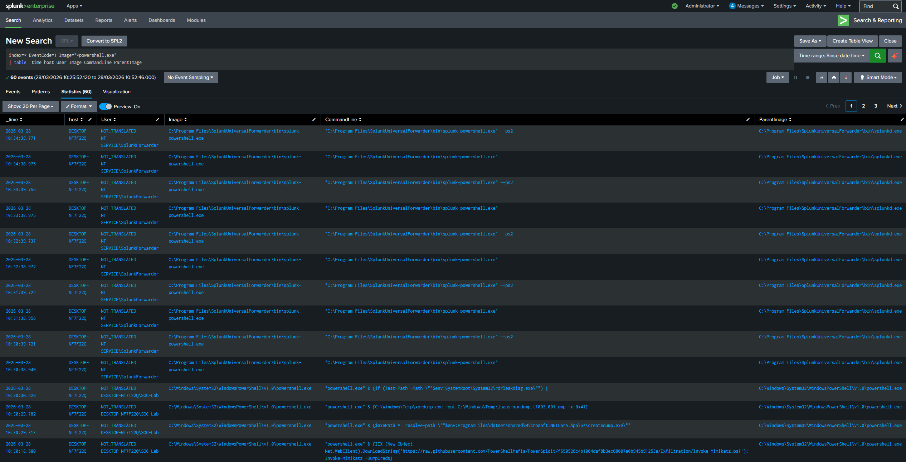
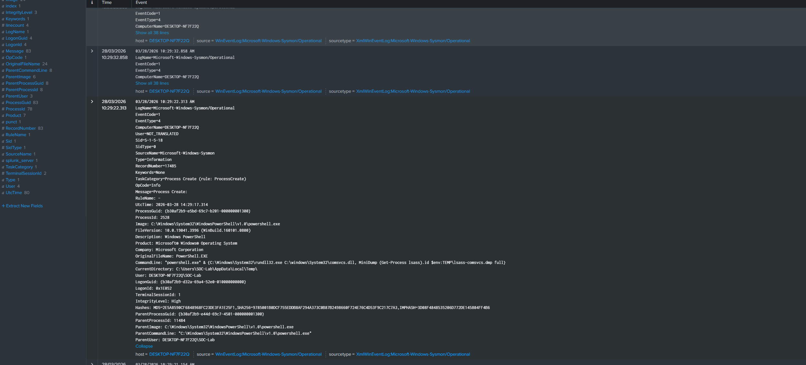

# T1003.001 - LSASS Credential Dumping

## Technique
LSASS memory dumping (MITRE ATT&CK T1003.001)

## What Happened
I simulated credential dumping activity in my lab and reviewed the logs in Splunk. The event data showed suspicious PowerShell activity related to LSASS dumping.

## Logs Observed
- Sysmon Event ID 1
- PowerShell execution
- Suspicious CommandLine activity
- ParentImage

## Detection Query
```spl
index=* EventCode=1 Image="*powershell.exe"
| table _time host User Image CommandLine ParentImage
```

## Why Suspicious
- PowerShell used rundll32.exe with comsvcs.dll MiniDump, which is related to credential dumping
- The command line showed activity targeting LSASS
- IntegrityLevel was High, which means the process ran with elevated privileges

## Screenshots

### Query Results


### Event Details


## Analyst Takeaway
This activity shows how attackers may try to access credentials by dumping LSASS memory. Looking at command-line activity, elevated privileges, and suspicious dumping behavior is important for detection.
