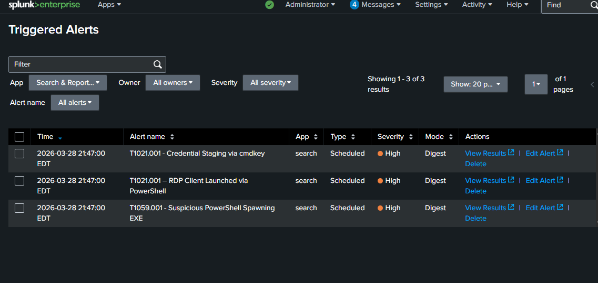
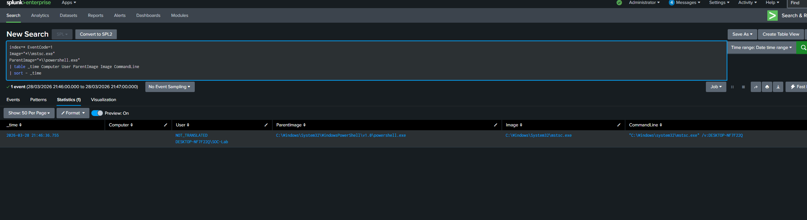
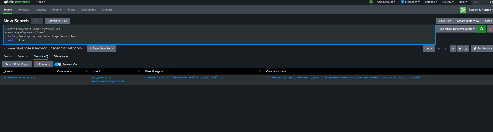
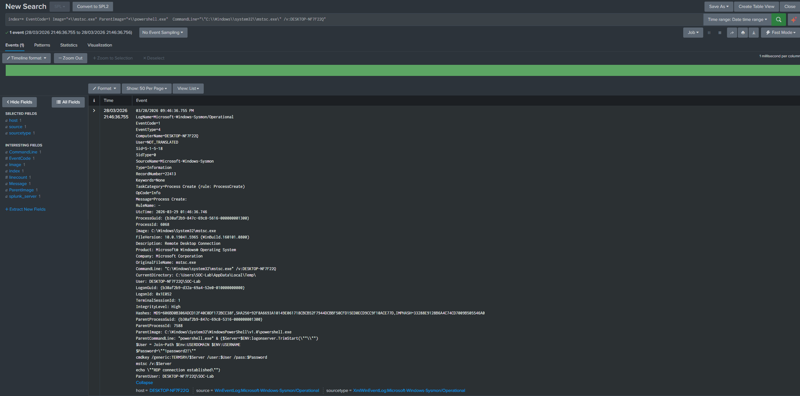
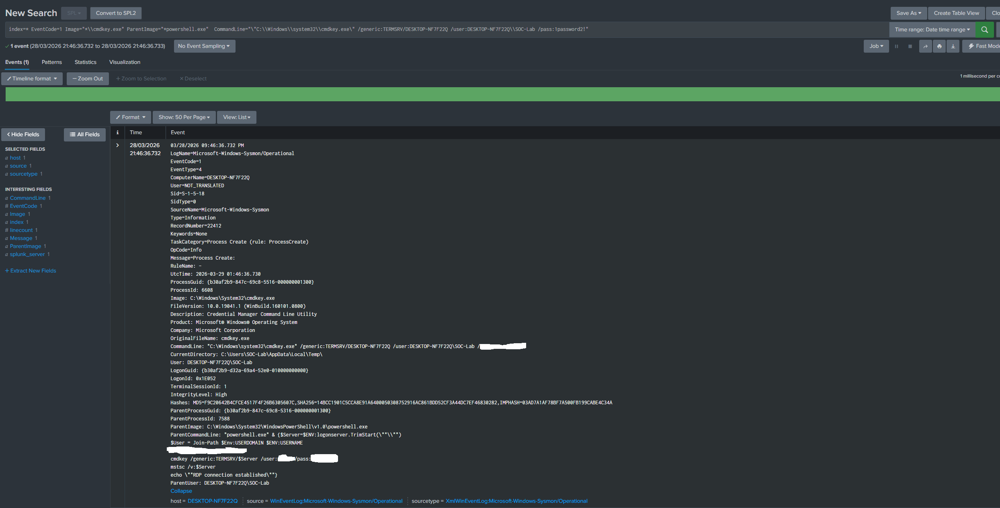

# T1021.001 - RDP Lateral Movement

## Technique
Remote Desktop Protocol (RDP) for lateral movement (MITRE ATT&CK T1021.001)

## What Happened
I simulated lateral movement in my lab by using PowerShell to run cmdkey.exe to store credentials and mstsc.exe to start an RDP connection.

## Logs Observed
- Sysmon Event ID 1
- PowerShell process activity
- cmdkey.exe executed from PowerShell
- mstsc.exe executed from PowerShell
- Command-line activity related to credential staging and RDP

## Detection Query
```spl
index=* EventCode=1 Image="*\\mstsc.exe" ParentImage="*\\powershell.exe"
| table _time Computer User ParentImage Image CommandLine
| sort - _time
```

## Why Suspicious
- PowerShell was used to run mstsc.exe
- cmdkey.exe was used to store credentials before the RDP connection
- This can be a sign of lateral movement using valid accounts

## Alert Validation
I also created two Splunk alerts for this activity:
- Credential staging via cmdkey
- RDP client launched via PowerShell

## Screenshots

### Triggered Alerts in Splunk


### RDP Query Results


### Credential Staging Query Results


### RDP Event Details


### Credential Staging Event Details


## Analyst Takeaway
This activity shows how an attacker can use stored credentials and RDP to move to another system. Looking at parent-child process behavior and command-line activity helps detect this.
