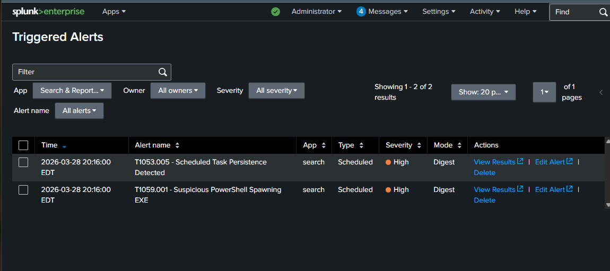
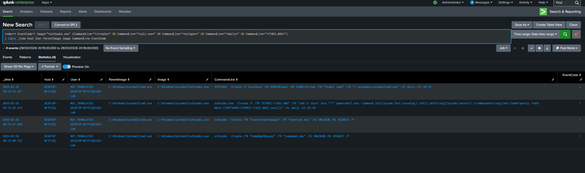
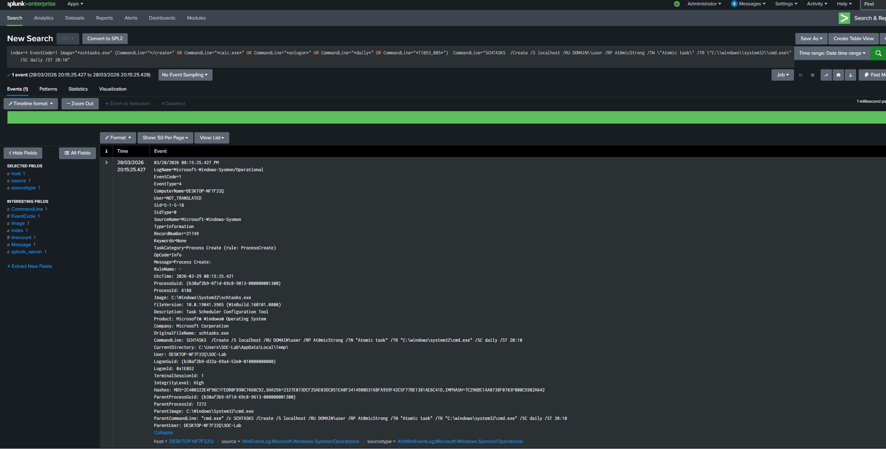

# T1053.005 - Scheduled Task Persistence

## Technique
Scheduled task creation for persistence or repeated execution (MITRE ATT&CK T1053.005)

## What Happened
I simulated persistence in my lab by creating scheduled tasks with schtasks.exe to run commands automatically on logon and on a schedule.

## Logs Observed
- Sysmon Event ID 1
- Process creation activity
- cmd.exe spawning schtasks.exe
- Scheduled task creation command-line activity

## Detection Query
```spl
index=* EventCode=1 Image="*schtasks.exe" (CommandLine="*/create*" OR CommandLine="*calc.exe*" OR CommandLine="*onlogon*" OR CommandLine="*daily*" OR CommandLine="*T1053_005*")
| table _time host User ParentImage Image CommandLine EventCode
```

## Why Suspicious
- schtasks.exe was used to create tasks for automatic execution
- The command line showed onlogon and daily task creation behavior
- cmd.exe spawning schtasks.exe can indicate persistence or repeated command execution

## Alert Validation
This detection was also configured as a Splunk alert and triggered during the simulation.

## Screenshots

### Triggered Alerts in Splunk


### Query Results


### Event Details


## Analyst Takeaway
This activity shows how attackers can use scheduled tasks to maintain persistence or repeatedly execute commands. Reviewing process creation and command-line behavior is important for detecting this technique.
