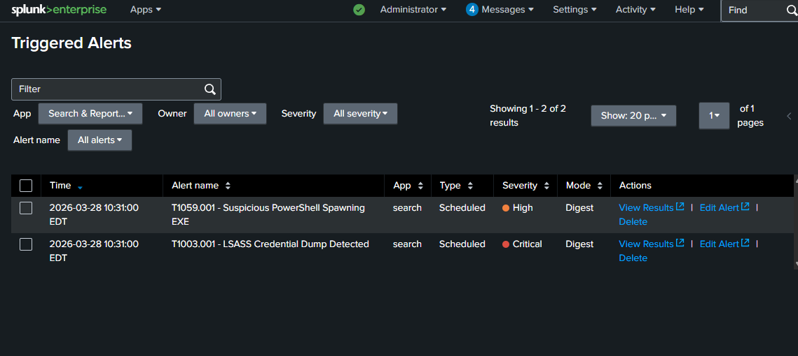
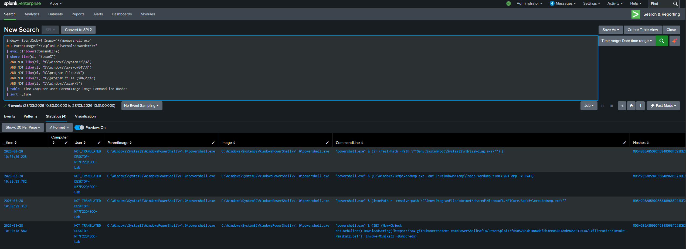

## Technique
PowerShell execution (MITRE ATT&CK T1059.001)

## What Happened
I simulated suspicious PowerShell activity in my lab and reviewed the logs in Splunk.

## Logs Observed
- Sysmon Event ID 1
- PowerShell process activity
- CommandLine
- ParentImage

## Detection Query
```spl
index=* EventCode=1 Image="*powershell.exe"
| table _time host User Image CommandLine ParentImage
```

## Why Suspicious
- PowerShell was used to invoke credential dumping tools (Invoke-Mimikatz, xordump.exe)
- Suspicious content was downloaded from a remote URL and executed in memory
- Command-line activity revealed unusual parent-child process relationships
- PowerShell was used as part of a multi-stage attack chain

## Alert Validation
This behavior was also tracked through a Splunk alert during lab testing.

## Screenshots

### Triggered Alerts in Splunk


### Detection Query in Splunk


### Event Details


## Analyst Takeaway
This activity shows how PowerShell can be abused for execution in attacks. Reviewing command-line activity and process details is important for detecting suspicious PowerShell behavior.
