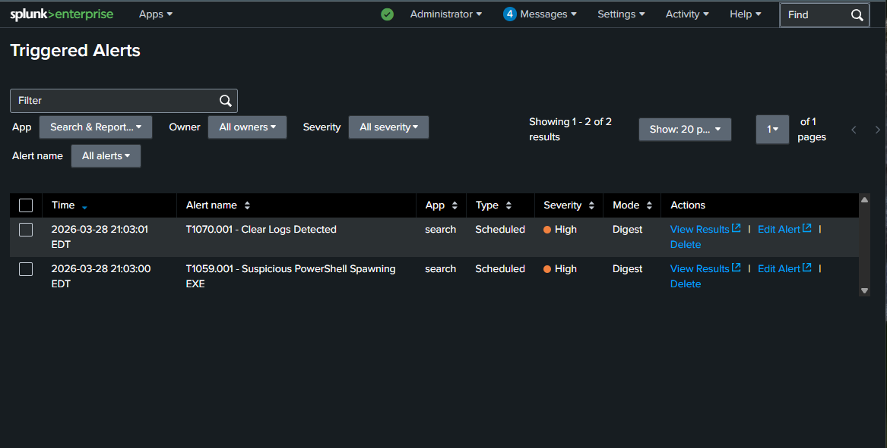
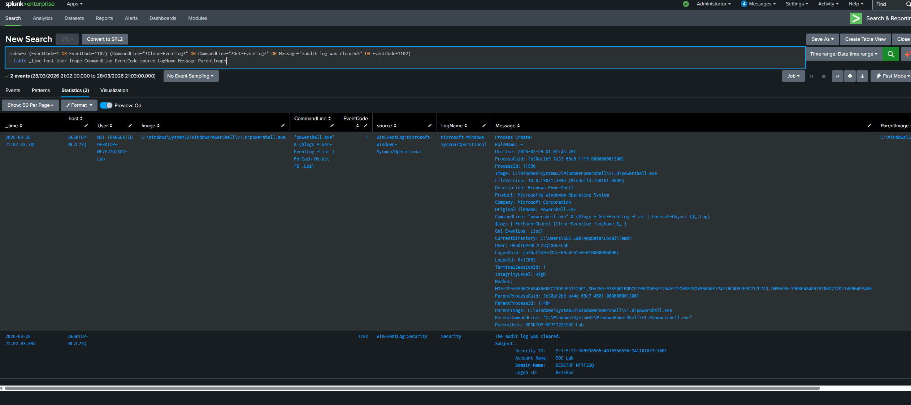
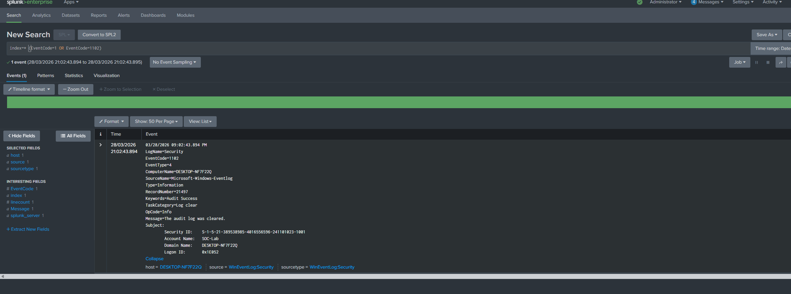

# T1070.001 - Clear Logs

## Technique
Clearing Windows event logs for defense evasion (MITRE ATT&CK T1070.001)

## What Happened
I simulated defense evasion in my lab by using PowerShell to enumerate event logs and clear them from the system.

## Logs Observed
- Sysmon Event ID 1
- PowerShell process activity
- Command-line activity related to Get-EventLog and Clear-EventLog
- Security Event ID 1102

## Detection Query
```spl
index=* (EventCode=1 OR EventCode=1102) (CommandLine="*Clear-EventLog*" OR CommandLine="*Get-EventLog*" OR Message="*audit log was cleared*" OR EventCode=1102)
| table _time host User Image CommandLine EventCode source LogName Message ParentImage
```

## Why Suspicious
- PowerShell was used to enumerate and clear Windows event logs
- Security Event ID 1102 showed that the audit log was cleared
- Clearing logs can be used to remove evidence of malicious activity

## Alert Validation
This detection was also configured as a Splunk alert and triggered during the simulation.

## Screenshots

### Triggered Alerts in Splunk


### Query Results


### Event Details


## Analyst Takeaway
This activity shows how attackers can use log clearing to hide evidence after malicious actions. Reviewing PowerShell command-line behavior and Security Event ID 1102 is important for detecting this technique.
