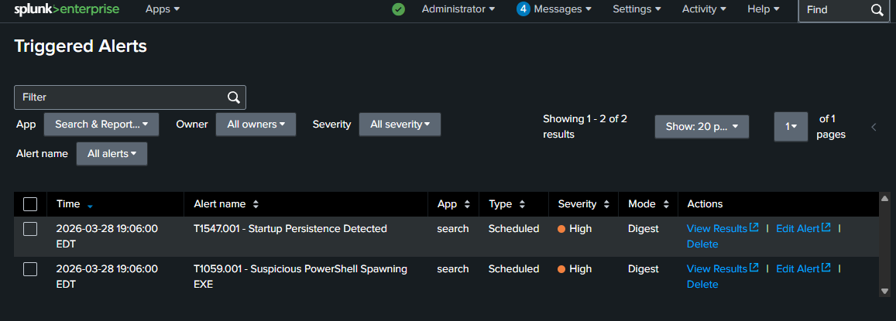
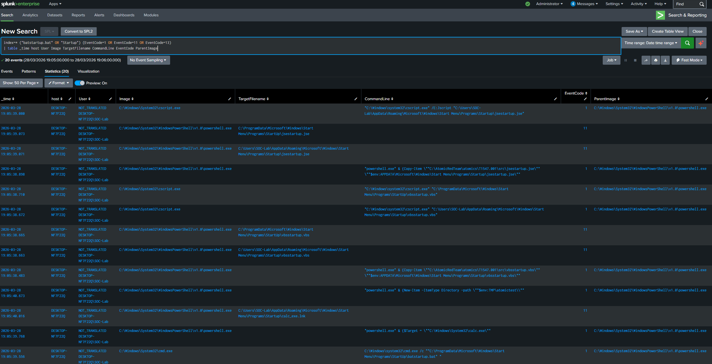
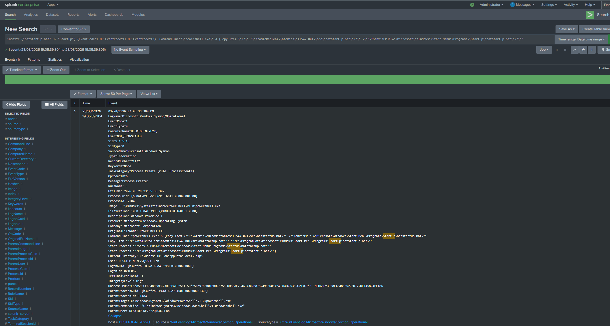

# T1547.001 - Startup Persistence

## Technique
Startup folder persistence (MITRE ATT&CK T1547.001)

## What Happened
I simulated persistence in my lab by copying a file into the Windows Startup folder so it could run automatically when the user logs in.

## Logs Observed
- Sysmon Event ID 1
- Sysmon Event ID 11
- File creation activity
- Process execution activity

## Detection Query
```spl
index=* ("batstartup.bat" OR "Startup") (EventCode=1 OR EventCode=11 OR EventCode=13)
| table _time host User Image TargetFilename CommandLine EventCode ParentImage
```

## Why Suspicious
- A file was copied into the Startup folder
- This behavior can be used to maintain persistence after reboot or logon
- File creation and related process activity can help identify this technique

## Alert Validation
This detection was also configured as a Splunk alert and triggered during the simulation.

## Screenshots

### Triggered Alerts in Splunk


### Startup Query Results


### Event Details


## Analyst Takeaway
This activity shows how attackers can use the Startup folder to maintain persistence. Looking at file creation, command-line activity, and related process behavior is important for detecting this technique.
