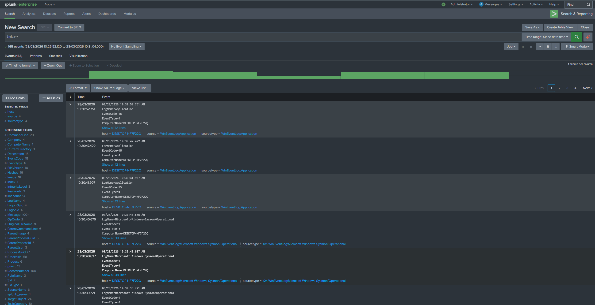

# SOC Home Lab

## Overview
This is my SOC home lab where I practice detection and investigation using Splunk and Sysmon. I simulate attacks and analyze logs like a real SOC analyst.

## Lab Architecture
- Ubuntu (Splunk SIEM)
- Windows 10 (victim machine with Sysmon)
- Kali Linux (attacker)

Logs from Windows are sent to Splunk using Splunk Universal Forwarder.

## Home Lab Screenshots

### Lab Setup

### Splunk Receiving Logs

### Sysmon Event Example

### PowerShell Detection Query

## Tools Used
- Splunk
- Sysmon
- Windows Event Logs
- Kali Linux
- MITRE ATT&CK

## Attack Detections

I simulate attacks and create detections based on real lab telemetry and logs.

- [T1003.001 - LSASS Credential Dumping](./2-Attack-Detections/T1003.001-LSASS-Dump/)
- [T1021.001 - RDP Lateral Movement](./2-Attack-Detections/T1021.001-RDP-Lateral-Movement/)
- [T1053.005 - Scheduled Task Persistence](./2-Attack-Detections/T1053.005-Scheduled-Task/)
- [T1059.001 - PowerShell Execution](./2-Attack-Detections/T1059.001-PowerShell/)
- [T1070.001 - Clear Logs](./2-Attack-Detections/T1070.001-Clear-Logs/)
- [T1547.001 - Startup Persistence](./2-Attack-Detections/T1547.001-Startup-Persistence/)

## Email Security Gateway (In Progress)
I am building an email security gateway using:
- Postfix
- SpamAssassin
- ClamAV
- Splunk

Goal: detect phishing and malicious emails.

## What I Learned
- How to simulate attacks mapped to MITRE ATT&CK
- How to analyze Sysmon and Windows event logs in Splunk
- How to write SPL queries to detect suspicious behavior
- How to configure scheduled alerts with severity levels in Splunk
- How to investigate execution, credential access, persistence, defense evasion, and lateral movement techniques
